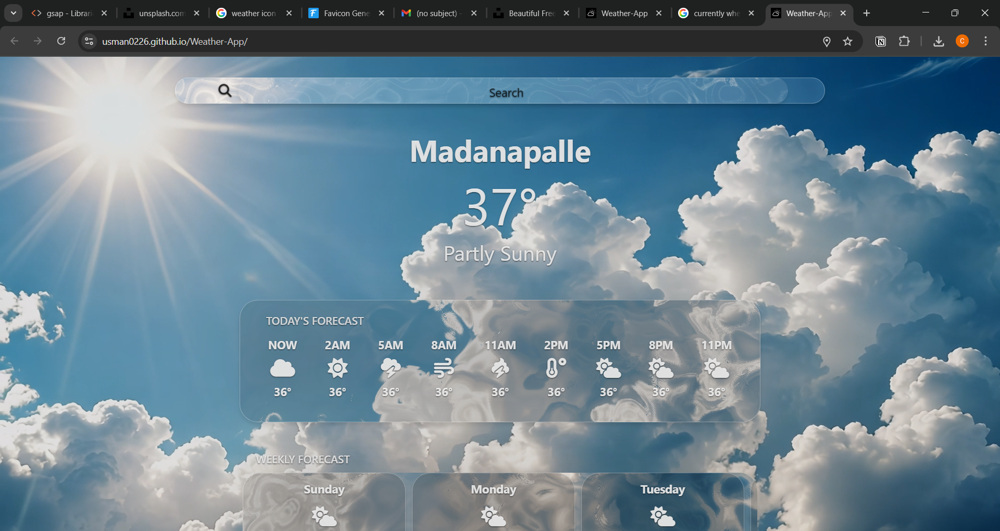

# 🌤️ Weather Forecast App – 

A fully self-built, highly interactive weather forecasting web app that shows:

# Live : 
- https://usman0226.github.io/Weather-App/

-  Current weather
-  Hourly forecast (today & tomorrow)
-  Weekly forecast (5 days)
-  Air Quality Index (AQI)
-  Dynamic background videos based on weather
-  Live search suggestions (with debounce)
-  Auto location weather on page load
-  Smooth scroll via Locomotive.js

🔧 Built entirely through self-written logic — no frameworks, no copied code.

---

## 🛠️ Technologies Used

- **HTML5 + CSS3**
- **Vanilla JavaScript**
- **OpenWeatherMap API**  
  ◦ Current weather  
  ◦ 5-day / 3-hour forecast  
  ◦ Air pollution (AQI)  
- **Geolocation API**
- **Font Awesome** for weather icons
- **Locomotive.js** for smooth scrolling

---

##  Features

-  **City-based search with live suggestions** (debounced input)
-  **Auto-fetch weather** using current geolocation
-  Current temperature, weather condition, wind stats
-  Hourly forecast blocks (with icons and time mapping)
-  Weekly forecast parsed via smart timestamp logic
-  Real-time AQI with emoji-based severity labels
-  Dynamic background video that changes with weather condition
-  Smooth scroll experience (mobile/tablet supported)
-  Mobile responsive + favicon

---

## 📦 Data Flow (ASCII Diagram)

```
User Input (Search bar)
        │
        ▼
 getweather(city)  ←────── Enter key or debounce input
        │
        ├─► updateWeather(data)
        │       └─► DOM update: city name, temp, wind, desc
        │
        ├─► UpdateIcon(data, "Now") → set weather icon
        │
        ├─► updateBgVideo(condition) → video.mp4 swap based on weather
        │
        ├─► getAQIndex(lat, lon)
        │       └─► updates AQI number + emoji label + slider
        │
        └─► hourlyForecast(city)
                ├─► hourForeCastData { "2PM": { temp, icon }, ... }
                └─► weeklyData {
                        Monday:  { maxtemp, mintemp, condition },
                        Tuesday: { ... },
                      }
```

---

## 📂 Core Function Breakdown

🔹 **getweather(city)**  
• Fetches current weather  
• Extracts lat/lon  
• Calls:
  ◦ updateWeather()  
  ◦ getAQIndex()  
  ◦ hourlyForecast()  

🔹 **updateWeather(data)**  
• Updates DOM elements (city, temp, wind, description)  
• Calls UpdateIcon() & updateBgVideo()

🔹 **UpdateIcon(data, timelabel)**  
• Matches `data.weather[0].main` to icon from:
```js
Icons = {
  Clear: "fa-sun",
  Rain: "fa-cloud-showers-heavy",
  ...
};
```
• Applies it to the relevant `#Icon-${timelabel}` element

🔹 **getAQIndex(lat, lon)**  
• Calls `/air_pollution` API  
• Gets `aqi = 1–5`, maps to:
```js
levels = {
  1: "Good ", 2: "Fair ", ...
};
```
• Updates label + slider

🔹 **hourlyForecast(city)**  
• Fetches 3-hour forecast data  
• For each:
  ◦ Converts UNIX → time label  
  ◦ Stores into:
```js
hourForeCastData = {
  "2PM": { temp: 34, icon: "Clouds" },
  ...
};
```
  ◦ Updates UI blocks if they exist

🔹 **Weekly Forecast Logic**  
• Picks 1 reading every 8 intervals  
• Converts date → day name via `.toLocaleDateString({ weekday })`  
• Stores in:
```js
weeklyData = {
  Monday: { maxtemp, mintemp, condition },
  ...
};
```
• Updates blocks like `#Monday-temp`, `#Monday-condition`

🔹 **updateBgVideo(condition)**  
• Checks `condition` (Clear, Rain, Snow…)  
• Loads and plays the respective video (`sunn.mp4`, `rain.mp4`, etc.)

---

##  Data Structures

 Hourly Forecast:
```js
hourForeCastData = {
  "2PM": { temp: 34, icon: "Clouds" },
  "5PM": { temp: 32, icon: "Rain" }
}
```

📆 Weekly Forecast:
```js
weeklyData = {
  Monday:  { maxtemp: 34, mintemp: 26, condition: "clear sky" },
  Tuesday: { ... }
}
```


## How to Use

1. **Clone the repo**
```bash
git clone https://github.com/your-username/weather-app.git
```

2. **Add your API key**
```js
const API_key = 'YOUR_API_KEY';
// Get it from: https://openweathermap.org/api
```

3. **Open index.html** in your browser

4. **Start typing a city** – get suggestions, click or press Enter!


## 📸 Screenshots
