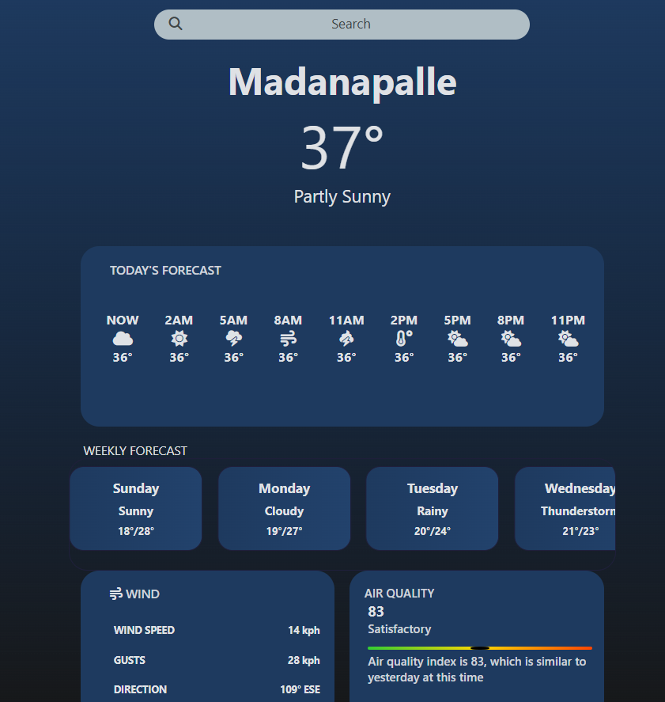

# 🌤️ Weather Forecast App

A fully self-built weather forecasting web app that shows:

- ✅ Current weather
- 🕐 Hourly forecast (today & tomorrow)
- 📆 Weekly forecast (5 days)
- 💨 Air Quality Index (AQI)

> 🔧 Built entirely through self-written logic 

---


## 🛠️ Technologies Used

- **HTML5 + CSS3**
- **Vanilla JavaScript (no frameworks)**
- **[OpenWeatherMap API](https://openweathermap.org/api)**:
  - Current weather
  - 5-day / 3-hour forecast
  - Air pollution (AQI)
- **Font Awesome** for weather icons

---

## 📈 Features

- 🔍 City-based weather search
- 🌡️ Temperature, weather condition, and wind stats
- 🕐 Hourly forecast blocks with live icons
- 📆 Weekly forecast using parsed daily data
- 💨 Real-time AQI with emoji-based severity label

---

## 📦 Data Flow (ASCII Diagram)

```
User Input (Search bar)
        │
        ▼
 getweather(city)  ←────── Enter key
        │
        ├─► updateWeather(data) ──► DOM: city, temp, wind, description
        │
        ├─► UpdateIcon(data, "Now") ──► sets icon based on weather condition
        │
        ├─► getAQIndex(lat, lon) ──► fetches & displays AQI
        │
        └─► hourlyForecast(city)
               ├─► hourForeCastData { "2PM": { temp, icon }, ... }
               └─► weeklyData {
                      Monday:  { maxtemp, mintemp, condition },
                      Tuesday: { ... },
                    }
```

---

## 📂 Core Function Breakdown

### 🔹 `getweather(city)`
- Fetches current weather data
- Extracts `lat`, `lon`
- Calls:
  - `updateWeather()`
  - `getAQIndex()`
  - `hourlyForecast()`

---

### 🔹 `updateWeather(data)`
- Updates DOM:
  - `h1`: city name
  - `.temp`: current temperature
  - `.Info`: condition description
  - Wind speed, gust, direction
- Calls `UpdateIcon(data, "Now")`

---

### 🔹 `UpdateIcon(data, timelabel)`
- Matches `data.weather[0].main` to icon from this object:
```js
Icons = {
  Clear: "fa-sun",
  Rain: "fa-cloud-showers-heavy",
  ...
};
```
- Applies icon to `#Icon-${timelabel}` element

---

### 🔹 `getAQIndex(lat, lon)`
- Calls:
  ```
  https://api.openweathermap.org/data/2.5/air_pollution
  ```
- Extracts AQI value (1–5)
- Maps to:
```js
levels = {
  1: "Good 🌿", 2: "Fair 🌤️", ...
};
```

---

### 🔹 `hourlyForecast(city)`
- Calls:
  ```
  /data/2.5/forecast?q=${city}
  ```
- For each item:
  - Converts UNIX → `Date` → time label
  - Stores in `hourForeCastData`:
  ```js
  {
    "2PM": { temp: 34, icon: "Clouds" },
    ...
  }
  ```
  - Updates UI if corresponding time block exists in the respective Object !

---

### 🔹 Weekly Forecast Logic
- Picks 1 timestamp per day (midpoint logic: `i += 8`)
- Converts date to weekday name:
  ```js
  toLocaleDateString({ weekday: "long" })
  ```
- Stores in `weeklyData`:
```js
{
  Monday: { maxtemp, mintemp, condition },
  ...
}
```
- Updates UI blocks like:
  - `#Monday-temp`
  - `#Monday-condition`

---

## 🧠 Data Structures

### 🕐 Hourly Forecast:
```js
hourForeCastData = {
  "2PM": { temp: 34, icon: "Clouds" },
  "5PM": { temp: 32, icon: "Rain" }
}
```

### 📆 Weekly Forecast:
```js
weeklyData = {
  Monday:  { maxtemp: 34, mintemp: 26, condition: "clear sky" },
  Tuesday: { ... }
}
```

---

## 💡 Developer Highlights

- ⌨️ DOM input handling with `keydown` and `.value`
- 🌐 Multiple asynchronous API calls
- 📦 JSON parsing & dynamic data mapping
- 🕓 Date/Time formatting & conversion
- 🎨 Dynamic icon rendering
- 🔄 Full data-to-UI pipeline built from scratch


## 📥 How to Use

1. Clone the repo:
   ```bash
   git clone https://github.com/your-username/weather-app.git
   ```

2. Add your API key to the JS file:
   ```js
   const API_key = 'YOUR_API_KEY'; (Get your API_key from OpenWeather webpage)
   ```

3. Open `index.html` in your browser.

4. Type any city and hit Enter!

---

## 📸 Screenshots
